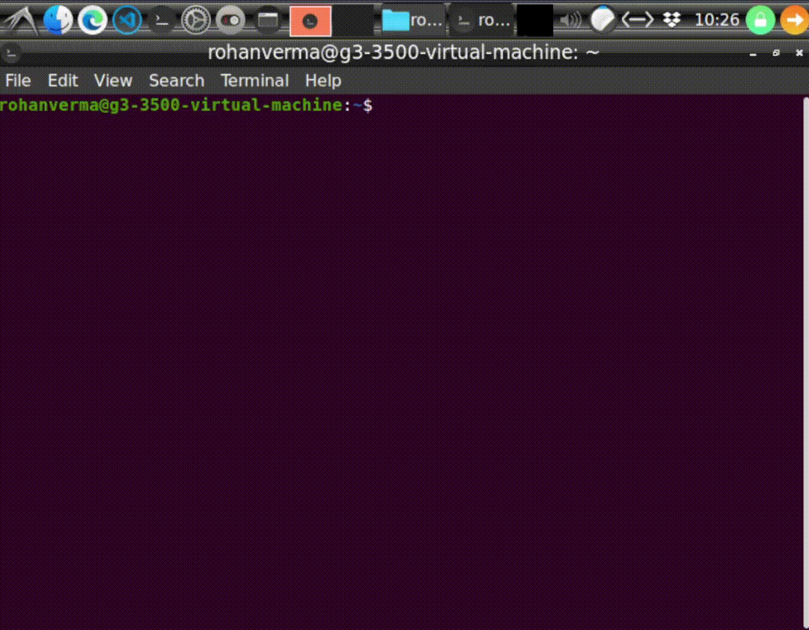

# Running the script



# INDEX

- [Running the script](#running-the-script)
- [INDEX](#index)
- [Introduction to Shell Basics](#introduction-to-shell-basics)
  - [What is Bash?](#what-is-bash)
  - [Fundamentals](#fundamentals)
  - [Shell Prompt](#shell-prompt)
  - [**Home directory** in Linux](#home-directory-in-linux)
- [Bash Scripts](#bash-scripts)
  - [Defining variables](#defining-variables)
  - [Separating Commands with Semicolons](#separating-commands-with-semicolons)
  - [`#` and `@` expressions in a Bash Script](#-and--expressions-in-a-bash-script)
- [Commands](#commands)
  - [`cd`](#cd)
    - [**Shortcuts**](#shortcuts)
  - [`mv`](#mv)
  - [`touch`](#touch)
  - [`echo`](#echo)
  - [`tee`](#tee)
  - [`dirname`](#dirname)
    - [`dd` command (For making bootable USBs and swap partitions)](#dd-command-for-making-bootable-usbs-and-swap-partitions)
  - [`readlink`](#readlink)
    - [**flags**](#flags)
  - [command substitution (`$`)](#command-substitution-)
  - [`chmod`](#chmod)
  - [comment operator (`<<`)](#comment-operator-)
- [Important Concepts](#important-concepts)
  - [File Names](#file-names)
  - [Single Quotes vs. Double Quotes in Bash](#single-quotes-vs-double-quotes-in-bash)
  - [Invoking interpreters using shebang (`#!`)](#invoking-interpreters-using-shebang-)
  - [Package Management](#package-management)
    - [Advanced Packaging Tool (`apt`)](#advanced-packaging-tool-apt)
      - [Functions of **apt** tool](#functions-of-apt-tool)
    - [Debian Package Installer `dpkg`](#debian-package-installer-dpkg)
    - [Alien Package Converter `alien`](#alien-package-converter-alien)
- [LXDE](#lxde)
  - [What is LXDE?](#what-is-lxde)
  - [Tips and Tricks](#tips-and-tricks)
    - [Installing LXDE](#installing-lxde)
    - [How to use LXDE after installing it](#how-to-use-lxde-after-installing-it)
    - [Increasing the Window button sizes](#increasing-the-window-button-sizes)

# Introduction to Shell Basics

## What is Bash?

The Linux command line is provided by a program called the shell. The default shell for many Linux distros is the GNU Bourne-Again Shell (bash).

Bash is very powerful as it can simplify certain operations that are hard to accomplish efficiently with a GUI. Remember that most servers do not have a GUI.

## Fundamentals

- Basic commands:
  - `pwd`: print working directory
  - `cd`: change directory
  - `ls`: list files and directories

- Unix-like operating systems and Windows have hierarchial directory structure (tree-like pattern of directories, called folders in other systems). 
- However, Windows has different drive letters for different storage devices and partitions, whereas Linux has only one file tree, and different devices can be on different branches of that tree.
- Linux has a root directory `‘/’` and all files and folders are contained inside it.
- The working directory on startup is `/home/<username>` which is the [**Home directory**](#home-directory-in-linux), but it can be anything set by the system administrator.

## Shell Prompt

When a shell is used interactively, it displays a `$` when it is waiting for a command from the user. This is called the **shell prompt**.

```console
rohan@ubuntu:~$ 
```

If shell is running as root, the prompt is changed to `#`. The superuser shell prompt looks like this:


```console
rohan@ubuntu:~#
```
Superuser has administrative privileges. This is dangerous, since superuser can delete/overwrite any file on the system. Operate as superuser ONLY when administrative 
privileges are needed.

## **Home directory** in Linux

`~` represents the **Home directory** of our linux system. Note that this is different from the `home` directory of the system. 

The **Home directory** stands for `/home/<user-name>` so we can use the tilde symbol (`~`) to not have to change our script for different users.

# Bash Scripts

Scripts start with a bash bang.
Scripts are also identified with a shebang. Shebang is a combination of `bash #` and `bang !`  followed by the bash shell path. 

```bash
#! /bin/bash
```

This is the first line of the script. Shebang tells the shell to execute it via bash shell. Shebang is simply an absolute path to the bash interpreter.

## Defining variables

We can define a variable by using the syntax `variable_name=value`. 

To get the value of the variable, add `$` before the variable name.

```bash
#!/bin/bash
# A simple variable example

greeting=Hello

echo $greeting
```

This can be considered as an example of [command substitution](#command-substitution) as we get values of variables when we type variable names directly in the terminal. 

## Separating Commands with Semicolons

When the shell sees a semicolon on a command line, it's treated as a command separator -- basically like pressing the ENTER key to execute a command. 

When would you want to use a semicolon instead of pressing ENTER? 
-  It's nice when you want to execute a series of commands, typing them all at once at a single prompt. 
    All of them will be visible on the same command line and they'll be grouped together in the history list.
  
    This makes it easy to see, later, that you intended this series of commands to be executed one after another. And you can re-execute them all with a simple history command. 

- It's useful with sleep to run a command after a delay. 
  ```bash
  echo "Type CTRL-c to abort logout"; sleep 10; exit
  ```
-  If you're running a series of commands that take some time to complete, you can type all the commands at once and leave them to run unattended. For example, if a two scripts need to be run in succession and they take a lot of time this is helpful.

## `#` and `@` expressions in a Bash Script

`@` - The array of parameters passed to a bash script
`#` - The number of positional parameters passed to a script.

We can use the command substitution method `$@`/`$#` in order to get the values of these expressions.

# Commands

## `cd`

Syntax: `cd <path name>`  
`<path name>` can be **absolute** or **relative** to the current working directory.

- **Absolute Pathname** starts with the root directory and follows the tree branch by branch until the path to the desired directory or file is completed. Example:  
  `/usr/bin` means
  - `/`: root directory
  - `user`: subdirectory of root
  - `bin`: subdirectory of `user`
- **Relative Pathname** starts from the working directory. Special notations:
  - `.` refers to the working directory itself. Example:
  ```console
  root@ubuntu:~$ cd ./Downloads
  root@ubuntu:~/Downloads$
  ```
  where `~/Downloads` stands for `/home/<username>/Downloads`.

  - `..` refers to the parent directory of the working directory. Example:
  ```console
  root@ubuntu:/usr/bin$ cd ..
  root@ubuntu:/usr$
  ```
  In both the above cases, we can make this change using absolute pathnames as well.

### **Shortcuts**

- `cd`: changes working directory to home directory
- `cd -`: changes working directory to the previous one
- `cd ~userName`: changes working directory to the home directory of the specified user  
<br>

## `mv`

To move a file in a terminal, we use the `mv` command to move a file from one location to another.

Note that if in case the destination has a file with the same name, it is OVERWRITTEN.

```console
root@ubuntu:~/Downloads$ mv example.txt ~/Documents

root@ubuntu:~/Downloads$ ls ~/Documents
example.txt
```
The file `example.txt` was moved from `/home/<username>/Downloads` to `/home/<username>/Documents`.

An important thing to note is, remember to use `sudo` when performing operations like moving because in most systems, all users don't have WRITE access everywhere. 

An alernative to this would be to use the command `chmod a+w ./path` to give everyone WRITE access at the place we wish to move the file but this could lead to vulnerabilities.

## `touch`

Syntax: `touch <filename>`
 
Navigate to the folder where the file is to be created or open a terminal within that folder. Run a command in the format shown above.

For example:
```console
root@ubuntu:~$ touch test.txt
root@ubuntu:~$
```
where the text between the `:` and the `$` sign stands for the current working directory (`~` is the Home directory).

## `echo`

Syntax: `echo <string>`  
Used to display `<string>` on the command-line. It is a built-in command used in shell scripts and batch files to output status text to the screen or a file.

## `tee`

The tee command reads standard input (stdin) and writes it to both standard output (stdout) and one or more files. tee is usually part of a pipeline, and any number of commands can precede or follow it.

So, for example, if we wish to append a new command to an executable file :
```console
root@ubuntu:~$ echo '<command>' | tee -a filename.sh
<command>
rohan@rohan-G3:~$ 
```
- The output of `echo '<command>'`, which is `<command>`, is displayed on the standard output device as shown, along with `<command>` being written to the file `filename.sh`.

- Here, the `-a` flag represents that the file should not be overwritten and the command should be appended to its end.

We can also prefix `sudo` to the `tee` command to be able to write to files that are read-only for guest users.
```bash
echo '<command>' | sudo tee -a filename.sh
```

Refer [this](https://phoenixnap.com/kb/linux-tee#:~:text=What%20Does%20tee%20Command%20Do,can%20precede%20or%20follow%20it.) for more information about `tee`.

## `dirname`

Syntax: `dirname <file-path>`  

This command prints the directory containing the supplied path.
If we supply a file/directory, `dirname` outputs the path containing that file/directory. 

For example:
```console
root@ubuntu:~$ dirname /home/example/foo
/home/example
root@ubuntu:~$
```

### `dd` command (For making bootable USBs and swap partitions)

Refer [this](https://linuxhint.com/dd_command_linux/).

## `readlink`

Used to obtain the full path of a file. `readlink` prints the absolute path of a symbolic link (a type of file in Linux that points to another file or a folder on your computer. Symlinks are similar to shortcuts in Windows.) or the absolute path for a supplied relative path.  
NOTE: It is vital that our current directory is a parent directory or higher of the file in question.

Syntax: `readlink [<flag>] <relative-path/file-name>`

### **flags**

If the conditions specified by these flags aren't met, an output isn't returned.
- `-f` : All but the last component (which is the file itself) in the supplied path must exist. If the path does not exist.
- `-e` : All components in the supplied path must exist.
- `-m` : None of the components in the supplied path are required to exist.

For example, obtaining absolute path using the relative path:
```console
root@ubuntu:~/home/example$ readlink -f foo/foo.txt
home/example/foo/foo.txt
root@ubuntu:~/home/example$
```

## command substitution (`$`)

Syntax: `$(command)`  
where `command` is executed in a sub-shell, and the output from `command` replaces its call.<br><br>
Command substitution can be used in combination with `dirname` to obtain the name of the directory which contains a specific file, without knowing even the relative path of that file.
```console
root@ubuntu:~$ dirname $(readlink -f file.txt)
/home/example/foo
root@ubuntu:~$
```

## `chmod`

`chmod` allows control of read, edit and run permission for files and directories. `chmod` stands for change 
mode.   

- Classes of users:  
  - user `u` : the person who created the file  
  - group `g`: people in a selected group  
  - other `o`: everyone else on the system  

- Classes of permissions:  
  - read `r`   : ability to see the contents of the file  
  - write `w`  : ability to change the contents of the file  
  - execute `x`: ability to execute the contents of the file  

- Operators for changing permissions:
  - plus `+` : the permission is added.
  - hyphen  `-` : the permission is disabled.
  - equal-to `=` : the permission is explicitly assigned. All other settings for that category (owner, group, or others) are reset. For example, `g=r` removes all permission from the group except read, and explicitly set read if not set already.

Syntax: `chmod u+x <file-name>`  
This command is used to give the shell script `<file-name>` executable permissions. 

A file retains the permissions it had even when its name is changed.


## comment operator (`<<`)
Syntax:
```console
<<comment-name
//Comment body

comment-name
```
where `comment-name` can be replaced by any string.

# Important Concepts

## File Names

- File names that begin with a period character are hidden. This means that `ls` will not list them unless we say `ls -a`, where `-a` means display all.
- File names in Linux, like Unix, are case sensitive.

## Single Quotes vs. Double Quotes in Bash

- [Single Quotes](https://www.gnu.org/savannah-checkouts/gnu/bash/manual/bash.html#Single-Quotes)
- [Double Quotes](https://www.gnu.org/savannah-checkouts/gnu/bash/manual/bash.html#Double-Quotes)

It is better to use Single Quotes unless you know what you are doing.

## Invoking interpreters using shebang (`#!`)

Shebang is a character sequence consisting of a hash sign and an exclamation mark (`#!`) and is used to tell the operating system which interpreter to use to parse the rest of the file.

The Shebang interpreter directive takes the following form:
```bash
#!interpreter [arguments]
```

The directive must be the first line in the script.

The directive must start with shebang (`#!`).

White space after the shebang characters (`#!`) is optional.

Interpreter is the full path to a binary file (ex: `/bin/sh`, `/bin/bash`).

Interpreter arguments are optional.

For example:

- `#!/bin/bash` - Uses bash to parse the file.
- `#!/usr/bin/env perl` - Uses the `env` command to find the path to the perl executable.
- `#!/usr/bin/python` - Executes the file using the python binary.


## Package Management

**Debian** has a robust packaging system and every component and application is built into a package that is installed on your system. 

### Advanced Packaging Tool (`apt`)

Debian uses a set of tools called **Advanced Packaging Tool** _(APT, not to be confused with the command `apt`)_ to manage this packaging system.

There are various tools that interact with APT and allow us to install, remove and manage packages in Debian based Linux distributions. `apt-get` is one such command-line tool which is widely popular.
However there is a problem of redundancy when it comes to `apt-get` commands, as there are a number of similar commands in the `apt-cache` tool.

Also, these commands are way too low level and they have so many functionalities which are perhaps never used by an average Linux user.
On the other hand, the most commonly used package management commands are scattered across `apt-get` and `apt-cache`.

The `apt` tool was introduced to solve this problem. `apt` consists some of the most widely used features from `apt-get` and `apt-cache` leaving aside obscure and seldom used features.

#### Functions of **apt** tool

- Maintains a package list, meaning it fetches a list of all the available software that can be installed on the platform. 
- `sudo apt update`: Updates the package list
- `sudo apt upgrade`: Upgrades the previously installed software to newer versions
- `sudo apt install <package-name>`: Used to install new software packages
- `sudo apt remove <package-name>`: Removes pieces of software WITHOUT breaking the system

### Debian Package Installer `dpkg`

`dpkg` is a tool to install, build, remove and manage Debian packages. The primary and more user-friendly front-end for `dpkg` is aptitude(1). 

Syntax:
```
dpkg [option...] action
```

`dpkg` itself is controlled entirely via command line parameters, which consist of exactly one action and zero or more options. 

The action-parameter tells `dpkg` what to do and options control the behavior of the action in some way.

Refer the official documentation on [man7.org](https://man7.org/linux/man-pages/man1/dpkg.1.html) to find out how to use `dpkg` and its various actions.

The simplest way to use `dpkg` to install a `.deb` package.
```
dpkg -i <package>.deb
```

### Alien Package Converter `alien`

Alien is a tool that converts different Linux package distribution file formats to Debian. 

It supports conversion between Linux Standard Base, `.rpm`, `.deb`, Stampede (`.slp`) and Slackware (`.tgz`) packages.

Ubuntu is a popular Debian based Linux distribution, and as such it uses `.deb` packages for installing software.

However, not all software is packaged in the `.deb` format. Some software maintainers only provide a `.rpm` package, which is a format used exclusively with Red Hat and CentOS based distributions.

Refer [this](https://www.serverlab.ca/tutorials/linux/administration-linux/how-install-rpm-packages-on-ubuntu-using-alien/) tutorial for information on how to use it.

# LXDE

## What is LXDE?

LXDE is a free desktop environment with comparitively low resource requirements. 

It is a good option for running Ubuntu VMs with 4 GBs of RAM or less since GNOME is a bit more resource heavy.

## Tips and Tricks

### Installing LXDE

Run the `lxde-install.sh` executable script present in this repo.

### How to use LXDE after installing it

1. Logout 
2. Reach the login screen and login after selecting LXDE as your desktop environment from the bottom right menu.
   
### Increasing the Window button sizes 


